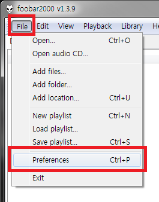
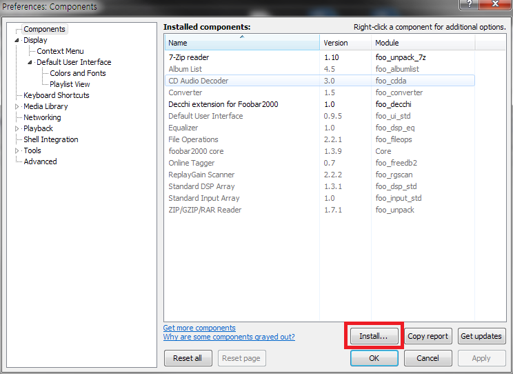

# 뎃찌EXT (Foobar 2000) : foo_decchi v1.1

***1.*** [여기](https://github.com/Usagination/Decchi/raw/songinfo/ext/foobar/foo_decchi.fb2k-component) 를 클릭해서 파일을 다운로드해요.

***2.*** Foobar 2000 을 실행해요.

***3.*** `File` - `Preferences` 를 클릭, 혹은 `Ctrl + P` 를 눌러요

***4.*** `Install...` 을 클릭해서 ***1*** 에서 다운로드한 파일을 선택해요!

***5.*** Foobar 2000 을 재실행하면 끝!

- - -
Copyright (c) 2016 Sasarino MARi & RyuaNerin